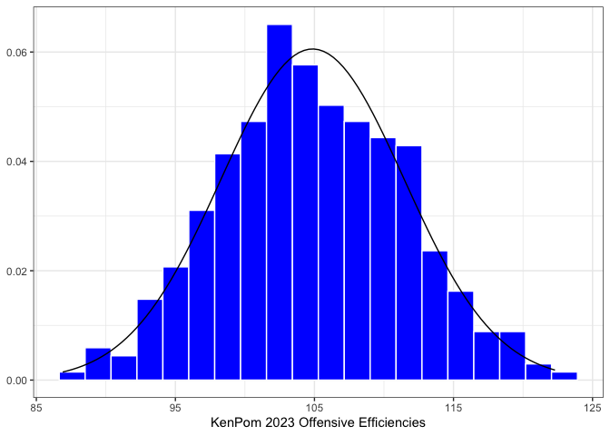
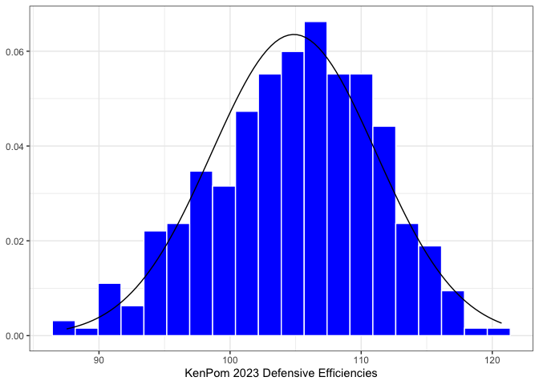
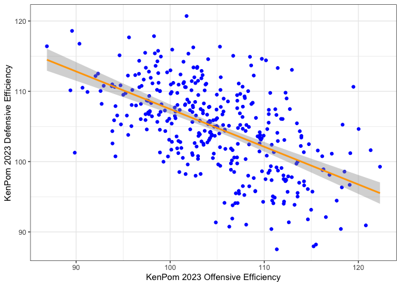
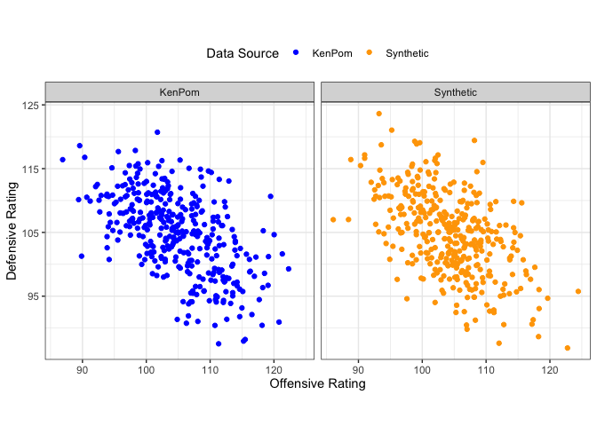
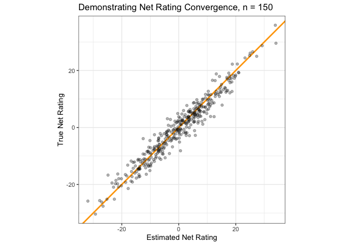
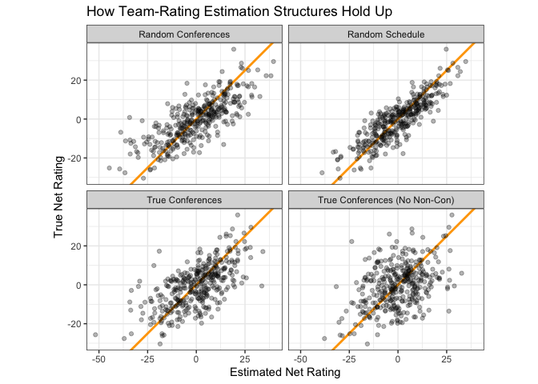
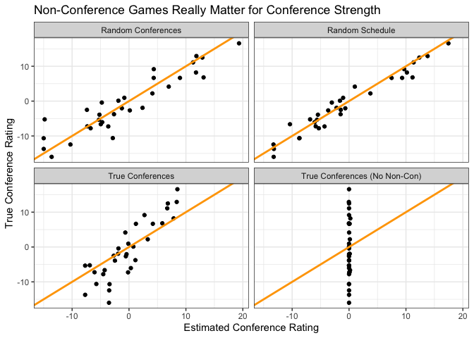

A Simulation Study of College Basketball Team Rating Systems
================

In February 2024, former Syracuse head coach Jim Boeheim called out Joe
Lunardi — ESPN’s lead “bracketologist,” the man who coined that term and
is today the public lightning rod for all debates about NCAA Tournament
selection process — for including just three ACC teams in his latest
forecast for the tournament field.[^1] “To say there’s three teams in
the tournament I don’t know what metrics you’re using. You’re using the
blind man metrics is what you’re using.”

Pittsburgh head coach Jeff Capel echoed Boeheim’s complaint three days
later: “I’m not a bracketology expert. I’m not a numbers expert. I know
what my eyes see. It’s frustrating that a lot of people sit behind a
computer and look at numbers and that’s the metrics they come up
with.”[^2] Capel’s Panthers snuck into the 2023 tournament in the First
Four as an 11-seed. They defeated Mississippi State, an SEC team ranked
higher at the time in every predictive rating system, then blew out Iowa
State, a Big 12 team *also* ranked higher at the time by every
predictive rating system, before bowing out to 3-seed Xavier in the
Round of 32.

The ACC’s gripes with the selection committee’s metrics have perhaps the
strongest basis in NCAA Tournament results of any major conference. Per
BartTorvik, the conference leads the NCAA with almost 13 more wins than
expected via predictive metrics entering the tournament between 2010 and
2023. That number will almost assuredly rise following the conclusion of
a 2024 tournament which saw the conference send three teams to the Elite
Eight and an 11-seed to the Final Four. Over that same time period, the
Big 12 and Mountain West — two frequent punching bags for
predictive-metric critiques — have each underperformed their
expectations by at least 10 wins.[^3]

However, they are by no means the *only* complaints. Sometimes, the ACC
isn’t the underdog hero against the elite conferences but instead a big
bad Power 6 conference keeping deserving mid-majors out of the field.
Just this year, Virginia received an at-large bid over an Illinois State
team ranked higher by every predictive metric. The ’Hoos went scoreless
for 52 minutes of real-life time and suffered a 25-point defeat to
Colorado State in the First Four while Illinois State advanced to the
NIT Final Four.

All this is to say that cherry-picking specific examples of teams
overperforming or underperforming their metrics entering the tournament
isn’t a very productive way to analyze predictive rating systems. For
every 10-seed Syracuse or 11-seed NC State, there’s a 2018 Virginia to
balance things out. For every 2023 FAU to assert mid-major superiority,
there’s, uh, a 2024 FAU. The NCAA Tournament is random. That’s why the
winner of a contest to algorithmically forecast 2022 March Madness
results finished in first place without actually using any of that
season’s data.[^4] That’s why the winner of your bracket pool will
inevitably have picked their Final Four based on their favorite mascots.

#### What does this post do, then?

I hope to take a more systemic approach to evaluating predictive college
basketball metrics in search of answering two major questions raised
about these systems:

1.  How big are the error bars on their team-strength estimates?

2.  How does the structure of college basketball scheduling,
    specifically the division of teams into conferences, affect these
    estimates?

For this study, I’ll be “picking on” KenPom for two key reasons. First,
the site is the most famous college basketball analytics page in the
game right now, and probably the one most readers are familiar with.
Second (and more importantly), KenPom makes its model diagnostics easily
accessible, which makes it easier to construct synthetic data models to
emulate KenPom.

#### How are we going to answer those questions?

To determine how large the margin of error is on team-strength estimates
by predictive ranking systems, we’ll generate an imaginary set of 362
college basketball teams with known offensive and defensive
efficiencies. Then, we’ll have each of those teams play a “typical”
college basketball schedule of about 30 games. We’ll run those games
through a simplified version of the adjusted-efficiency-margin system to
estimate the team strengths based on our made-up season’s results.
Finally, we’ll compare the estimated ratings to the known underlying
ratings of each team.

To analyze the impact of the conference structure on college basketball
predictive metrics, we’ll actually run this experiment four different
times:

1.  Each team plays 30 other teams chosen at random.

2.  Each team plays 10 teams chosen at random (“non-con”) and then
    approximately 20 games against a “random” conference. These random
    conferences are assigned by taking the list of actual conference
    affiliations for the 2023 season and randomly assigning each
    conference to a team.[^5]

3.  Each team plays 10 teams chosen at random (“non-con”) and then
    approximately 20 games against a “true” assigned conference. The
    problem with Experiment 2 is that in the real world conferences
    aren’t assigned at random: it’s a fair bet that every year every
    team in the Big 12 will be better than every team in the NEC. To
    better reflect reality, we take the list of synthetic teams and rank
    them 1 to 362 by net rating. Then, we use the conferences of each
    team 1-362 in the final 2023 KenPom ratings to assign each synthetic
    team its “true” conference. For example, UConn is in the Big East
    and finished 1st in the 2023 KenPom ratings. So, the highest-rated
    team in our synthetic data is assigned to the Big East. This more
    accurately resembles the true structure of college basketball’s
    conferences.[^6]

4.  Repeat of Experiment 3, but with zero non-con games and
    approximately 30 conference games per team. This gives us a better
    look at exactly what scheduling “bubbles” does to predictive metrics
    by taking the example to the extreme.

In both cases, we’ll analyze how the estimated team ratings using an
efficiency-ratings system compare to the true underlying team ratings in
the data-generating process.

With that out of the way, let’s get into the experiment.[^7]

## Generating Synthetic Data

Before we can simulate any games, we need to invent some teams. These
teams should resemble the “true” distribution of college basketball team
strengths, so we’re going to literally base them on the KenPom ratings
after the 2023 NCAA Tournament. As it turns out, offensive and defensive
efficiencies are approximately Normally distributed — the graphs below
show the distributions of offensive and defensive ratings in blue, with
a Normal distribution overlaid with a mean and variance equal to the
sample mean and sample variance of offensive and defensive ratings,
respectively. What matters here is that these distributions match up
closely enough to the observed data to generate reasonable synthetic
data from a multivariate Normal distribution.

#### KenPom 2023 Histograms



There is one caveat before we go just randomly sampling values:
offensive and defensive ratings are not uncorrelated. Teams with good
offenses also tend to have good defenses — something that everyone knows
about basketball, and also something we can confirm at a glance from
simply plotting offensive and defensive ratings against one another.

#### Offensive and Defensive Ratings Aren’t Independent



#### Generating Synthetic Data

To account for this correlation, we need to also specify the covariance
matrix of the multivariate Normal distribution based on sample variance
and covariance. Thankfully, R very handily makes it easy to sample from
multivariate Normal distributions with given means and
variance-covariance matrices using the `MASS` package’s `mvrnorm`
function.

First, we estimate the means and the variance-covariance matrix from the
data:

``` r
O.mu <- mean(kp$AdjOE)
D.mu <- mean(kp$AdjDE)
O.sigma <- var(kp$AdjOE)
D.sigma <- var(kp$AdjDE)
OD.cor <- cov(kp$AdjOE, kp$AdjDE)

OD.mus <- c(O.mu, D.mu)
OD.cov.matrix <- matrix(c(O.sigma, OD.cor, OD.cor, D.sigma), nrow = 2, ncol = 2)
```

Then we write a function to sample a random team from the data and
repeat that function 362 times:

``` r
generate_synthetic_team <- function() {
  team <- MASS::mvrnorm(mu = OD.mus, Sigma = OD.cov.matrix)
  team.df <- data.frame(off = team[1], def = team[2])
  return(team.df)
}

teams <- map_dfr(.x = seq(1,362), .f = ~ generate_synthetic_team())
```

#### Verifying Actual and Synthetic Data Match

Plotting our synthetic data confirms that it convincingly resembles the
KenPom 2023 data.



## Generating and Simulating the Schedule

This section will be code-light and concept-heavy.

#### Generating Schedules

Random scheduling is quite easy to do. First, we randomly arrange the
teams 1 to 362. Then, the teams are split in half and essentially
“stacked” on top of each other, and each column corresponds to a game
pairing. Finally, to create the next pairing of games the second row is
shifted by one element to the right.

If that doesn’t make sense, here’s an example of how to generate a
random schedule of two games for six teams.

First, we randomly sort the TeamIDs 1, 2, 3, 4, 5, 6, split in half, and
then stack. This gives us our final schedule of three games for Week 1:
4 vs. 6, 2 vs. 3, and 5 vs. 1.

| Game 1 | Game 2 | Game 3 |
|--------|--------|--------|
| 4      | 2      | 5      |
| 6      | 3      | 1      |

Now, we shift the bottom row to the right to obtain gameweek 2: 4 vs. 1,
2 vs. 6, and 5 vs. 3.

| Game 4 | Game 5 | Game 6 |
|--------|--------|--------|
| 4      | 2      | 5      |
| 1      | 6      | 3      |

To schedule within conferences, we follow a similar method but allow the
helper function `roundrobin` from the `Gmisc` package to handle the
scheduling for us.[^8] We can now generate an arbitrary number of games
both in and out of conference for each team.

#### Simulating Games

This is where we have to make some assumptions (scary). Instead of the
code, we can explain the game-simulation model in terms of the
assumptions our game simulation model makes.

1.  Each team’s expected points scored and allowed is a linear
    combination of their offensive efficiency and their opponent’s
    defensive efficiency, with equal weight given to each value.

2.  To account for game-level variance (the best team doesn’t win 100
    percent of the time!) we randomly sample from a Normal distribution
    with a mean equal to each team’s expected points from (1) and a
    standard deviation of 7.99 points. This value might seem extremely
    arbitrary, but it’s chosen for a very specific reason: when setting
    each team’s game-level standard deviation in points scored to 7.99,
    we end up with a mean absolute error on our season-long MOV
    predictions equal to 8.98 points — which just so happens to be the
    KenPom MAE for the 2023 season.

That’s it. Obviously, this is a pretty major simplification of
basketball. In simulation-land, there is no home court advantage. Every
team plays at the same tempo. Team ratings are constant throughout the
season. Team rating *uncertainty* is also constant throughout the
season. None of these assumptions in the simulations are true in real
life. But they make it easier to draw conclusions about our toy
efficiency-margin models.

#### Calculating Team Ratings

Essentially, for every game a team plays we look at their opponent’s
season-long efficiencies *excluding that game*, compare that to the way
the team played in the game, and find the difference. If Team 1 scored
1.20 PPP against Team 2 and Team 2 allowed 0.90 PPP on average in their
other games, Team 1 receives a +0.30 offensive rating for that game.
This is repeated for every game a team plays in a season, and then their
offensive and defensive ratings are calculated by averaging their
offensive and defensive performances in each game. Note that by virtue
of the assumptions in game simulation, this very basic efficiency-margin
system works — for example, because of the assumption that team ratings
are stationary for the full season, we don’t need to worry about recency
weighting.

## Results

First, just to verify that the efficiency-rating system outlined in the
previous section works in a perfect world, here’s a plot of what it
looks like to simulate a very large number of games (150, in this case)
against random teams and then use the team-ratings algorithm to estimate
their performance. Remember, we’re looking for the estimated and actual
ratings to match.



How does that chart look for our four scheduling options with
approximately 30 games per team apiece? The random schedule does the
best job producing net rating estimates which align with a team’s true
rating. Assigning random conferences and then playing random games
doesn’t seem to cause too much trouble, either. It’s when we start
grouping conferences based on team strength that real problems begin to
emerge; when we don’t have *any* non-conference cross-pollination to
work with, our team rating estimates seem almost no better than random.



The below table puts some hard numbers to those charts — the mean
absolute error of our estimates using the 30-game random schedule is
only 5.30 rating points, but that number balloons to 8.18 when playing
the approximate “actual” college basketball schedule of 10 non-con games
and 20 conference games.

<div id="xbruyonlvk" style="padding-left:0px;padding-right:0px;padding-top:10px;padding-bottom:10px;overflow-x:auto;overflow-y:auto;width:auto;height:auto;">
<style>@import url("https://fonts.googleapis.com/css2?family=Lato:ital,wght@0,100;0,200;0,300;0,400;0,500;0,600;0,700;0,800;0,900;1,100;1,200;1,300;1,400;1,500;1,600;1,700;1,800;1,900&display=swap");
#xbruyonlvk table {
  font-family: Lato, system-ui, 'Segoe UI', Roboto, Helvetica, Arial, sans-serif, 'Apple Color Emoji', 'Segoe UI Emoji', 'Segoe UI Symbol', 'Noto Color Emoji';
  -webkit-font-smoothing: antialiased;
  -moz-osx-font-smoothing: grayscale;
}
&#10;#xbruyonlvk thead, #xbruyonlvk tbody, #xbruyonlvk tfoot, #xbruyonlvk tr, #xbruyonlvk td, #xbruyonlvk th {
  border-style: none;
}
&#10;#xbruyonlvk p {
  margin: 0;
  padding: 0;
}
&#10;#xbruyonlvk .gt_table {
  display: table;
  border-collapse: collapse;
  line-height: normal;
  margin-left: 0;
  margin-right: auto;
  color: #333333;
  font-size: 16px;
  font-weight: normal;
  font-style: normal;
  background-color: #FFFFFF;
  width: auto;
  border-top-style: solid;
  border-top-width: 3px;
  border-top-color: #FFFFFF;
  border-right-style: none;
  border-right-width: 2px;
  border-right-color: #D3D3D3;
  border-bottom-style: solid;
  border-bottom-width: 2px;
  border-bottom-color: #A8A8A8;
  border-left-style: none;
  border-left-width: 2px;
  border-left-color: #D3D3D3;
}
&#10;#xbruyonlvk .gt_caption {
  padding-top: 4px;
  padding-bottom: 4px;
}
&#10;#xbruyonlvk .gt_title {
  color: #333333;
  font-size: 24px;
  font-weight: initial;
  padding-top: 4px;
  padding-bottom: 4px;
  padding-left: 5px;
  padding-right: 5px;
  border-bottom-color: #FFFFFF;
  border-bottom-width: 0;
}
&#10;#xbruyonlvk .gt_subtitle {
  color: #333333;
  font-size: 85%;
  font-weight: initial;
  padding-top: 3px;
  padding-bottom: 5px;
  padding-left: 5px;
  padding-right: 5px;
  border-top-color: #FFFFFF;
  border-top-width: 0;
}
&#10;#xbruyonlvk .gt_heading {
  background-color: #FFFFFF;
  text-align: left;
  border-bottom-color: #FFFFFF;
  border-left-style: none;
  border-left-width: 1px;
  border-left-color: #D3D3D3;
  border-right-style: none;
  border-right-width: 1px;
  border-right-color: #D3D3D3;
}
&#10;#xbruyonlvk .gt_bottom_border {
  border-bottom-style: solid;
  border-bottom-width: 2px;
  border-bottom-color: #D3D3D3;
}
&#10;#xbruyonlvk .gt_col_headings {
  border-top-style: solid;
  border-top-width: 2px;
  border-top-color: #D3D3D3;
  border-bottom-style: solid;
  border-bottom-width: 2px;
  border-bottom-color: #D3D3D3;
  border-left-style: none;
  border-left-width: 1px;
  border-left-color: #D3D3D3;
  border-right-style: none;
  border-right-width: 1px;
  border-right-color: #D3D3D3;
}
&#10;#xbruyonlvk .gt_col_heading {
  color: #333333;
  background-color: #FFFFFF;
  font-size: 80%;
  font-weight: bolder;
  text-transform: uppercase;
  border-left-style: none;
  border-left-width: 1px;
  border-left-color: #D3D3D3;
  border-right-style: none;
  border-right-width: 1px;
  border-right-color: #D3D3D3;
  vertical-align: bottom;
  padding-top: 5px;
  padding-bottom: 6px;
  padding-left: 5px;
  padding-right: 5px;
  overflow-x: hidden;
}
&#10;#xbruyonlvk .gt_column_spanner_outer {
  color: #333333;
  background-color: #FFFFFF;
  font-size: 80%;
  font-weight: bolder;
  text-transform: uppercase;
  padding-top: 0;
  padding-bottom: 0;
  padding-left: 4px;
  padding-right: 4px;
}
&#10;#xbruyonlvk .gt_column_spanner_outer:first-child {
  padding-left: 0;
}
&#10;#xbruyonlvk .gt_column_spanner_outer:last-child {
  padding-right: 0;
}
&#10;#xbruyonlvk .gt_column_spanner {
  border-bottom-style: solid;
  border-bottom-width: 2px;
  border-bottom-color: #D3D3D3;
  vertical-align: bottom;
  padding-top: 5px;
  padding-bottom: 5px;
  overflow-x: hidden;
  display: inline-block;
  width: 100%;
}
&#10;#xbruyonlvk .gt_spanner_row {
  border-bottom-style: hidden;
}
&#10;#xbruyonlvk .gt_group_heading {
  padding-top: 8px;
  padding-bottom: 8px;
  padding-left: 5px;
  padding-right: 5px;
  color: #333333;
  background-color: #FFFFFF;
  font-size: 80%;
  font-weight: bolder;
  text-transform: uppercase;
  border-top-style: solid;
  border-top-width: 2px;
  border-top-color: #D3D3D3;
  border-bottom-style: solid;
  border-bottom-width: 2px;
  border-bottom-color: #D3D3D3;
  border-left-style: none;
  border-left-width: 1px;
  border-left-color: #D3D3D3;
  border-right-style: none;
  border-right-width: 1px;
  border-right-color: #D3D3D3;
  vertical-align: middle;
  text-align: left;
}
&#10;#xbruyonlvk .gt_empty_group_heading {
  padding: 0.5px;
  color: #333333;
  background-color: #FFFFFF;
  font-size: 80%;
  font-weight: bolder;
  border-top-style: solid;
  border-top-width: 2px;
  border-top-color: #D3D3D3;
  border-bottom-style: solid;
  border-bottom-width: 2px;
  border-bottom-color: #D3D3D3;
  vertical-align: middle;
}
&#10;#xbruyonlvk .gt_from_md > :first-child {
  margin-top: 0;
}
&#10;#xbruyonlvk .gt_from_md > :last-child {
  margin-bottom: 0;
}
&#10;#xbruyonlvk .gt_row {
  padding-top: 7px;
  padding-bottom: 7px;
  padding-left: 5px;
  padding-right: 5px;
  margin: 10px;
  border-top-style: solid;
  border-top-width: 1px;
  border-top-color: #F6F7F7;
  border-left-style: none;
  border-left-width: 1px;
  border-left-color: #D3D3D3;
  border-right-style: none;
  border-right-width: 1px;
  border-right-color: #D3D3D3;
  vertical-align: middle;
  overflow-x: hidden;
}
&#10;#xbruyonlvk .gt_stub {
  color: #333333;
  background-color: #FFFFFF;
  font-size: 80%;
  font-weight: bolder;
  text-transform: uppercase;
  border-right-style: solid;
  border-right-width: 2px;
  border-right-color: #D3D3D3;
  padding-left: 5px;
  padding-right: 5px;
}
&#10;#xbruyonlvk .gt_stub_row_group {
  color: #333333;
  background-color: #FFFFFF;
  font-size: 100%;
  font-weight: initial;
  text-transform: inherit;
  border-right-style: solid;
  border-right-width: 2px;
  border-right-color: #D3D3D3;
  padding-left: 5px;
  padding-right: 5px;
  vertical-align: top;
}
&#10;#xbruyonlvk .gt_row_group_first td {
  border-top-width: 2px;
}
&#10;#xbruyonlvk .gt_row_group_first th {
  border-top-width: 2px;
}
&#10;#xbruyonlvk .gt_summary_row {
  color: #333333;
  background-color: #FFFFFF;
  text-transform: inherit;
  padding-top: 8px;
  padding-bottom: 8px;
  padding-left: 5px;
  padding-right: 5px;
}
&#10;#xbruyonlvk .gt_first_summary_row {
  border-top-style: solid;
  border-top-color: #D3D3D3;
}
&#10;#xbruyonlvk .gt_first_summary_row.thick {
  border-top-width: 2px;
}
&#10;#xbruyonlvk .gt_last_summary_row {
  padding-top: 8px;
  padding-bottom: 8px;
  padding-left: 5px;
  padding-right: 5px;
  border-bottom-style: solid;
  border-bottom-width: 2px;
  border-bottom-color: #D3D3D3;
}
&#10;#xbruyonlvk .gt_grand_summary_row {
  color: #333333;
  background-color: #FFFFFF;
  text-transform: inherit;
  padding-top: 8px;
  padding-bottom: 8px;
  padding-left: 5px;
  padding-right: 5px;
}
&#10;#xbruyonlvk .gt_first_grand_summary_row {
  padding-top: 8px;
  padding-bottom: 8px;
  padding-left: 5px;
  padding-right: 5px;
  border-top-style: double;
  border-top-width: 6px;
  border-top-color: #D3D3D3;
}
&#10;#xbruyonlvk .gt_last_grand_summary_row_top {
  padding-top: 8px;
  padding-bottom: 8px;
  padding-left: 5px;
  padding-right: 5px;
  border-bottom-style: double;
  border-bottom-width: 6px;
  border-bottom-color: #D3D3D3;
}
&#10;#xbruyonlvk .gt_striped {
  background-color: #FAFAFA;
}
&#10;#xbruyonlvk .gt_table_body {
  border-top-style: solid;
  border-top-width: 2px;
  border-top-color: #D3D3D3;
  border-bottom-style: solid;
  border-bottom-width: 2px;
  border-bottom-color: #D3D3D3;
}
&#10;#xbruyonlvk .gt_footnotes {
  color: #333333;
  background-color: #FFFFFF;
  border-bottom-style: none;
  border-bottom-width: 2px;
  border-bottom-color: #D3D3D3;
  border-left-style: none;
  border-left-width: 2px;
  border-left-color: #D3D3D3;
  border-right-style: none;
  border-right-width: 2px;
  border-right-color: #D3D3D3;
}
&#10;#xbruyonlvk .gt_footnote {
  margin: 0px;
  font-size: 90%;
  padding-top: 4px;
  padding-bottom: 4px;
  padding-left: 5px;
  padding-right: 5px;
}
&#10;#xbruyonlvk .gt_sourcenotes {
  color: #333333;
  background-color: #FFFFFF;
  border-bottom-style: none;
  border-bottom-width: 2px;
  border-bottom-color: #D3D3D3;
  border-left-style: none;
  border-left-width: 2px;
  border-left-color: #D3D3D3;
  border-right-style: none;
  border-right-width: 2px;
  border-right-color: #D3D3D3;
}
&#10;#xbruyonlvk .gt_sourcenote {
  font-size: 12px;
  padding-top: 4px;
  padding-bottom: 4px;
  padding-left: 5px;
  padding-right: 5px;
}
&#10;#xbruyonlvk .gt_left {
  text-align: left;
}
&#10;#xbruyonlvk .gt_center {
  text-align: center;
}
&#10;#xbruyonlvk .gt_right {
  text-align: right;
  font-variant-numeric: tabular-nums;
}
&#10;#xbruyonlvk .gt_font_normal {
  font-weight: normal;
}
&#10;#xbruyonlvk .gt_font_bold {
  font-weight: bold;
}
&#10;#xbruyonlvk .gt_font_italic {
  font-style: italic;
}
&#10;#xbruyonlvk .gt_super {
  font-size: 65%;
}
&#10;#xbruyonlvk .gt_footnote_marks {
  font-size: 75%;
  vertical-align: 0.4em;
  position: initial;
}
&#10;#xbruyonlvk .gt_asterisk {
  font-size: 100%;
  vertical-align: 0;
}
&#10;#xbruyonlvk .gt_indent_1 {
  text-indent: 5px;
}
&#10;#xbruyonlvk .gt_indent_2 {
  text-indent: 10px;
}
&#10;#xbruyonlvk .gt_indent_3 {
  text-indent: 15px;
}
&#10;#xbruyonlvk .gt_indent_4 {
  text-indent: 20px;
}
&#10;#xbruyonlvk .gt_indent_5 {
  text-indent: 25px;
}
</style>
<table class="gt_table" data-quarto-disable-processing="false" data-quarto-bootstrap="false">
  <thead>
    <tr class="gt_col_headings">
      <th class="gt_col_heading gt_columns_bottom_border gt_left" rowspan="1" colspan="1" scope="col" id="Schedule Type">Schedule Type</th>
      <th class="gt_col_heading gt_columns_bottom_border gt_right" rowspan="1" colspan="1" scope="col" id="MAE">MAE</th>
      <th class="gt_col_heading gt_columns_bottom_border gt_right" rowspan="1" colspan="1" scope="col" id="RMSE">RMSE</th>
      <th class="gt_col_heading gt_columns_bottom_border gt_right" rowspan="1" colspan="1" scope="col" id="R-Squared">R-Squared</th>
    </tr>
  </thead>
  <tbody class="gt_table_body">
    <tr><td headers="schedule_type" class="gt_row gt_left">Random Schedule</td>
<td headers="mae" class="gt_row gt_right">5.30</td>
<td headers="rmse" class="gt_row gt_right">6.57</td>
<td headers="pearson_r_sq" class="gt_row gt_right">74.3%</td></tr>
    <tr><td headers="schedule_type" class="gt_row gt_left gt_striped">Random Conferences</td>
<td headers="mae" class="gt_row gt_right gt_striped">7.47</td>
<td headers="rmse" class="gt_row gt_right gt_striped">9.65</td>
<td headers="pearson_r_sq" class="gt_row gt_right gt_striped">58.6%</td></tr>
    <tr><td headers="schedule_type" class="gt_row gt_left">True Conferences</td>
<td headers="mae" class="gt_row gt_right">8.18</td>
<td headers="rmse" class="gt_row gt_right">10.44</td>
<td headers="pearson_r_sq" class="gt_row gt_right">41.5%</td></tr>
    <tr><td headers="schedule_type" class="gt_row gt_left gt_striped">True Conferences (No Non-Con)</td>
<td headers="mae" class="gt_row gt_right gt_striped">9.88</td>
<td headers="rmse" class="gt_row gt_right gt_striped">12.65</td>
<td headers="pearson_r_sq" class="gt_row gt_right gt_striped">15.8%</td></tr>
  </tbody>
  &#10;  
</table>
</div>

What’s the source of this error? It’s the “bubble” effect: when teams
play insular groupings of teams on their schedule, it becomes much more
challenging to draw conclusions about how they relate to the larger
whole. If — for example — ACC teams only played other ACC teams, it
would be impossible to figure out how the ACC compares to the rest of
college basketball writ large.

**Inter-conference play is the glue that holds any predictive rating
system together.**

The below chart looks at how well the efficiency rating system
identifies the true conference strengths within the data. Based on what
we know about the “bubble” effect, we should expect the system to do
pretty well at identifying true conference strength with the fully
random schedule and the randomized-conferences schedule, though the
latter will have more variance as its results are essentially based on
fewer games. For the schedule with 10 non-con games and then 20 games
against “true” conferences, the conference strength estimates should be
biased towards zero because once teams enter conference play there’s no
opportunity for the conference to gain or lose strength. And for the
schedule with 30 conference games, we don’t expect any conference
strength estimates to deviate from zero because there are no
non-conference games to base those estimates on.

The data pretty much confirm these priors:



How do we get around the bubble problem? Remember, the raw actual
ratings for college basketball correspond to the “True Conferences”
panel in the above plot. Option 1 is adding some prior estimates of
conference strength based on previous seasons to our estimates of each
team’s strength in a conference. This gets us closer to the ground truth
than the unadjusted option — and I suspect is the way most public
predictive rating systems work — but there is something frustrating
about teams potentially being penalized or rewarded by the selection
committee based on the performance of other teams from other
seasons.[^9] Option 2 is a revision of the way college basketball
scheduling works to incorporate more non-conference games into the
season.

## Conclusions

#### What can we learn from this experiment?

The exact numbers on team ratings should be taken with a grain of salt.
*Even if a rating system’s estimates of team strength were perfectly
accurate*, the variance inherent to a short 30-game season (and
additional variance incurred by limiting two-thirds of that schedule to
games between conference “bubbles”) means that offensive and defensive
efficiency estimates will always have quite a bit of unavoidable error.
This issue is only exacerbated by the frequent usage of ordinal ranks
when describing team ratings via a specific rating system
(i.e. incessant “Only teams in the top X on KenPom can win the NCAA
Tournament!” tweets), a practice which is narratively very satisfying
but not particularly meaningful in practice.

The numbers in this study can be used as a grain-of-salt upper bound on
predictive-metric error. Every team-rating system out there is smarter
than this naive efficiency rating system.[^10] But that 8.11 MAE value
is a useful benchmark to keep in mind — if you think that (your
predictive rating system du jour) is twice as good as this system,
that’s still a mean absolute error of at least four points of net
rating. Predictive rating systems are better than just about anything
else at identifying how good teams are, but they aren’t perfect, or
really anywhere near perfect — something that all of their creators
would tell you in a heartbeat.

As for the conference question? It’s an unavoidable part of the
structure of college basketball that conference play will exist and that
there will be a hierarchy between conferences. This damages predictive
team rating systems in two ways compared to a totally randomized
schedule. First, it increases the variance of our team strength
estimates in general. Second, it limits the information we can glean
about relative conference strength. This necessitates the hacky solution
of using conference strength in previous seasons to inform estimates of
conference strength in a given season — the alternative is
conference-strength estimates incredibly sensitive to non-con play —
which can be very frustrating from a team’s perspective: why are we
being penalized for what a team last season did or didn’t do?

The particulars of the college basketball schedule — specifically, the
fact that almost all pre-tournament non-conference games are played
early in the season — also eliminate the potential for team rating
systems to pick up on differences in how different teams improve over
the course of the season by conference. That’s another concern Boeheim
et. al. have raised on more than one occasion.

#### Where do we go from here?

What’s the best fix? I’m partial to a solution I read about on Ken
Pomeroy’s blog a few years ago but am unable to track down at the
moment: hold some slots open later in the season for teams to schedule a
few non-conference games around the end of the season.[^11] This lets
bubble teams from mid-majors potentially pick up big resume wins. It
further informs predictive rating systems through the inclusion of more
non-conference games, which we’ve established are the lifeblood of team
rating estimation. And it even allows for the potential detection of an
interaction between conference and team improvement over the course of
the season. Best of all, it’s not a drastic enough shakeup to actually
cause major issues in the college basketball landscape, so it feels
feasible.

Leaving a week empty in the middle of conference season to allow teams
to schedule their own non-con games is the best bang-for-buck solution
to the insular conference problem. It would make team rating systems
more accurate, less reliant on previous-season data, and generally more
effective tools for selecting NCAA Tournament games. It would add a ton
of entertaining games to the schedule as strong mid-majors and
middle-of-the-road P6 teams have mutual interest in scheduling matchups
with one another. There have been plenty of major changes to the college
basketball landscape over the previous few seasons. What’s one more?

[^1]: <https://x.com/WRALBobHolliday/status/1753996220937216348?s=20>

[^2]: <https://www.si.com/college/pittsburgh/basketball/pitt-panrhers-jeff-capel-calls-out-acc-disrespect>

[^3]: Full rankings available here:
    <https://barttorvik.com/cgi-bin/ncaat.cgi?conlimit=&yrlow=2010&yrhigh=2023&type=conf&sort=1>

[^4]: <https://www.kaggle.com/competitions/mens-march-mania-2022/discussion/317316>

[^5]: The reason the games don’t exactly add up to 30 for each team is
    because of conferences with odd numbers of teams, which necessarily
    require “bye weeks.” Some teams will play 31-32 games, some will
    play 28-29, but in the aggregate the total number of games played
    will be almost identical to Experiment 1.

[^6]: The two independent teams, Chicago State and Hartford, were
    assigned to the NEC to make sure there wasn’t actually a
    two-team-conference. This has a negligible effect on the results of
    the study.

[^7]: I’ve kept this file purposefully code-light and focused on the
    results above all else. The full code will be included in a separate
    GitHub repository which will be linked at the bottom of the article.

[^8]: This is because I am bad at writing efficient code.

[^9]: When I built a game projection system for men’s college basketball
    last season, this was the approach I employed: reweighting the
    rankings to add approximately 40% of a conference’s average rating
    in the previous season to all of its ratings for the current season.
    Warts and all, it does make forecasts more accurate.

[^10]: Except the AP Poll, ba dum tss.

[^11]: If anyone finds this article, please send it to me.
